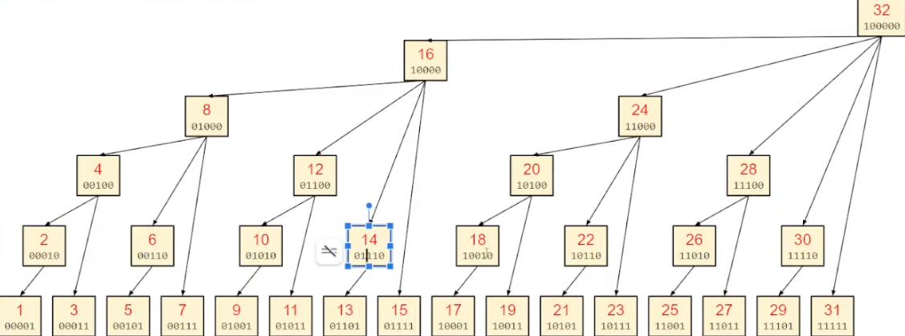

# BIT Tree



## Code template

```java

class BIT {
    int[] bit;
    int n;

    void update(int x, int v) {
        for (; x <= n; x += (x & -x)) bit[x] += v;
    }

    int get(int x) {
        int res = 0;
        for (; x >= 1; x &= (x - 1)) res += bit[x];
        return res;
    }
}

```

## Explanation

BIT is a tree-like structure, having `n` nodes from `1` to `n`

### What is `i & -i`?

Parent node of node `i` is node `i + (i & -i)`, where the result of `(i & -i)` is the largest power of 2 (i.e, `2^k`)
that `(i & -i) % 2^k = 0`

- Example:
    - if `i` is odd, `i = 1, 3, 5, 7, 9` =>  `(i & -i) = 2^0 = 1` => parent is `parent = 2, 4, 6, 8, 10`
    - if `i = 2^k` (e.g: `i = 2, 4, 8, 16`) => `(i & -i) = 2^k` => parent is `parent = 2^(k + 1)`

- Mathematically, `(i & -i)` returns the lowest set bit (set bit from the right)
    - Example:

      ```txt
        000111000  ( 24)
      & 111001000  (-24)
      -----------
        000001000  ( 8) -> set bit = 3
      ```

### update (int x, int v)

In the for loop, we assign `x` to its parent by doing `x += (x & -x)`

In essence, this means that we traverse from: current node `x` -> its parent -> its grandparent -> ..., and add `v` unit
to the visited node.

**Like prefix sum**, by adding `v` to node `x` and all its ancestor nodes, `bit[x]` will represent the cumulative sum of
the subtree rooted at x.

- Example:
    - Subtree root 12 contains 4 nodes 9 -> 12, with binary representation as follows:

      ```txt
      9  = 01001 (lv 0, leaf)
      10 = 01010 (lv1, par of 9)
      11 = 01011 (lv0, leaf)
      12 = 01100 (lv2, par of 10, 11)
     
              12   (level 2)
            /   |
          10    |  (level 1)
        /       | 
      9        11  (level 0)
      ```

### get (int x)

`get(int x)` has an operation `x &= x - 1`, which deletes the right-most set bit in binary representation of `x`.
Operation `res += bit[x]` accumulates the sum of all nodes in subtree `x`/

- Example:
    ```txt
             x  = 10101000 
         x - 1  = 10100111 
    x & (x - 1) = 10100000 
    ```

- Example: `get(x = 22)`
    ```txt
    x = 10110 = 22 => res += bit[22] (subtree root 22, contains 21 -> 22)
    x = 10100 = 20 => res += bit[20] (subtree root 20, contains 17 -> 20)
    x = 10000 = 16 => res += bit[16] (subtree root 16, contains 1 -> 16)
    x = 0 => end loop
  
  => res = bit[22] + bit[20] + bit[16]
         = (21 -> 22) + (17 -> 20) + (1 -> 16)
    ```